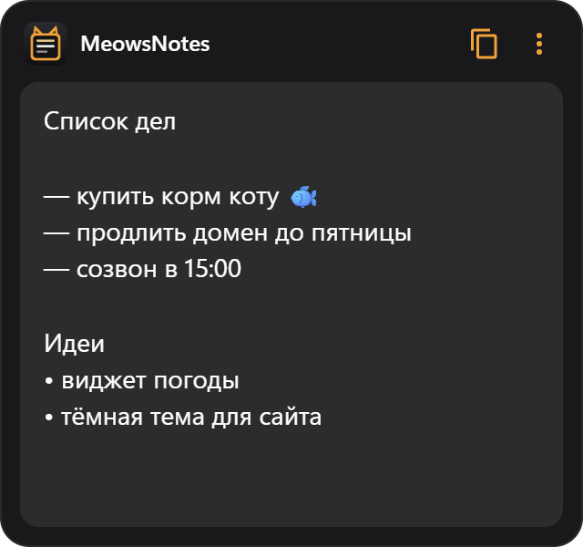

# MeowsNotes

<p align="center"></p>

Виджет заметок для рабочего стола Windows 10/11 в стиле MeowsConvert и MeowsClock.

- Просто пишите текст — он сохраняется сам (через полсекунды после ввода и при выходе/выключении ПК).
  Если записать файл не получилось, в шапке появится красное «Не удалось сохранить».
- Размер меняется как угодно: тяните за любой край или угол (220–1600 × 130–1400 px). Размер и позиция запоминаются.
- Виджет встроен в рабочий стол: не перекрывает программы и не прячется при «Свернуть всё»
  (Win+D, жест тремя пальцами). Перетаскивается за шапку.
- Кнопка «копировать» — весь текст в буфер. `Tab` — отступ, `Esc` — убрать курсор, `Ctrl+S` — сохранить сразу.
- Правый клик по тексту — вырезать/копировать/вставить и исправления орфографии (русский и английский).
  Правый клик по шапке или `⋮` — размер текста, поверх окон, прозрачность, стандартный размер, автозапуск, скрыть.
- Автозапуск с Windows включён по умолчанию — после перезагрузки виджет и текст на месте.
- Иконка в трее: вернуть скрытый виджет, настройки, выход.
- Место (и размер) виджета запоминаются относительно монитора: при подключении/отключении экрана, смене масштаба
  или разрешения виджет остаётся на своём мониторе, а не уезжает на соседний.

## Скачать

[Последний релиз](https://github.com/MrMe0ws/MeowsNotes/releases/latest) — Windows 10/11 x64:

- `MeowsNotes.Setup.X.Y.Z.exe` — установщик (ярлык на рабочем столе, удаление через «Приложения»);
- `MeowsNotes-X.Y.Z-portable.zip` — без установки: распаковать и запустить `MeowsNotes.exe`.

Файлы не подписаны, поэтому SmartScreen может предупредить о неизвестном издателе:
«Подробнее» → «Выполнить в любом случае».

## Где лежит текст

`%APPDATA%\MeowsNotes\notes.txt` — обычный текстовый файл (UTF-8), можно открыть Блокнотом.
При каждом запуске предыдущая версия копируется в `notes.backup.txt` — если текст случайно стёрли,
его можно достать оттуда (до следующего перезапуска виджета).

## Запуск

```
npm install
npm start
```

## Сборка установщика

```
npm run dist
```

Установщик появится в `dist/`.
